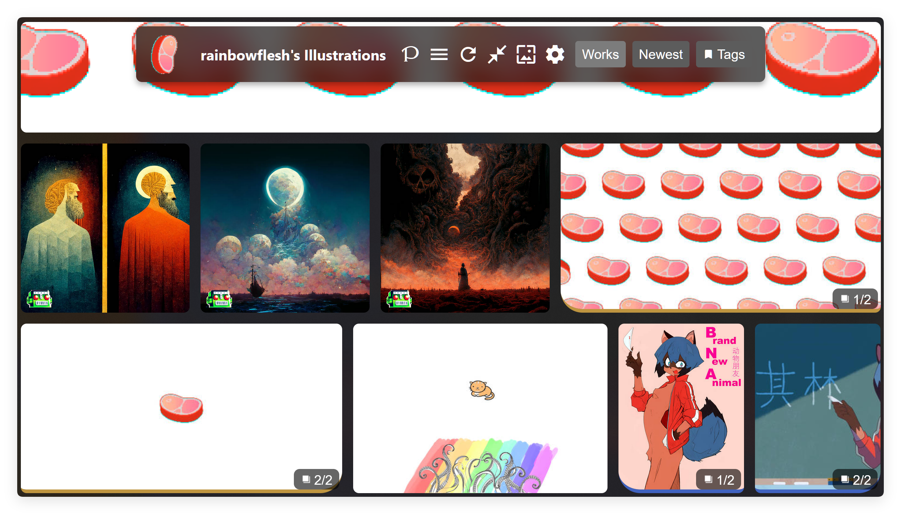

# PPixiv Plus

A PPixiv overhaul.

## What's news

- New ui style;
- Morden UX;
- Optimization, performance boots;
- More biased invasive changing;
- Compatible with ppixiv;
- And more ...

## Install

Get on [Greasyfork](https://greasyfork.org/en/scripts/537094-pppixiv-for-pixiv "https://greasyfork.org/en/scripts/537094-pppixiv-for-pixiv")

Or [click me](https://github.com/rainbowflesh/pppixiv/releases/latest/download/pppixiv.user.js "https://github.com/rainbowflesh/pppixiv/releases/latest/download/pppixiv.user.js")

### Note

ADblock may cause compatibility issue, disable it.

## Build

`python -m vview.build.build_ppixiv`

## Live Debug

`python -m http.server 8000 && python -m vview.build.build_ppixiv --url http://localhost:8000`

Install fellow script: `output/ppixiv-debug.user.js;`
